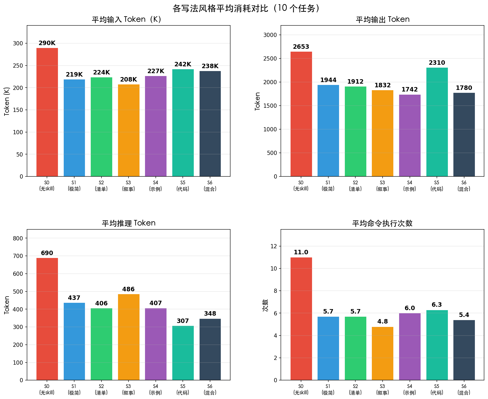

# Skill 写法风格对 AI Agent 任务执行的影响：实验报告

## 1. 研究背景与动机

在使用 AI Agent（如 Codex CLI、Claude Code 等）执行业务任务时，开发者需要通过 SKILL.md（或 AGENTS.md）文件向 Agent 传达业务规则。一个核心但缺乏系统研究的问题是：**同样的业务规则，用不同的写法风格呈现，是否会影响 Agent 的执行正确率和 Token 消耗？**

本实验旨在回答：
1. 不同写法风格是否影响任务正确率？
2. 不同写法风格的 Token 消耗差异有多大？
3. 没有 Skill 文件时，Agent 能否自行推断业务规则？

---

## 2. 实验设计

### 2.1 自变量：7 种写法风格

| 编号 | 风格 | 描述 | 典型字数 |
|------|------|------|----------|
| **S0** | 无 Skill（基线） | 仅提供通用指令 "You are a helpful assistant"，不提供任何业务规则 | ~15 词 |
| **S1** | 极简型 (Minimal) | 用最精炼的语言压缩所有规则，YAML 头 + 1-3 句话，无标题无列表 | 30-80 词 |
| **S2** | 清单型 (Checklist) | Markdown 标题 + 要点列表，命令式短句（MUST/NEVER），按概念分区 | 100-200 词 |
| **S3** | 叙事型 (Narrative) | 段落式描述，解释规则背景和原因，教程/政策文档风格 | 200-400 词 |
| **S4** | 示例驱动型 (Example-driven) | 极少叙述，通过 4-5 个完整输入→输出示例传达规则，Few-shot 范式 | 150-300 词 |
| **S5** | 代码模板型 (Code-template) | 以可执行 Python 代码为主要载体，自然语言仅作为连接说明 | 150-400 词 |
| **S6** | 混合型 (Hybrid) | 融合自然语言描述、列表、代码、示例、表格，类似专业 API 文档风格 | 300-600 词 |

**信息守恒原则**：同一任务的 6 种写法（S1-S6）传达的业务规则完全相同——相同的公式、阈值、约束条件和输出格式。差异仅在表达形式。

### 2.2 因变量

| 指标 | 说明 | 度量方式 |
|------|------|----------|
| 正确率 | 输出结果与标准答案的匹配比例 | 枚举型精确匹配，数值型容差匹配 |
| 输入 Token | 模型消耗的输入 Token 数 | 从 JSONL 的 `turn.completed` 事件提取 |
| 输出 Token | 模型生成的输出 Token 数 | 同上 |
| 推理 Token | 模型内部推理消耗的 Token 数 | 同上 |
| 命令执行次数 | Agent 执行 shell 命令的次数 | 从 JSONL 的 `item.completed` 事件统计 |

### 2.3 实验任务（10 个）

每个任务包含 10 条输入记录，Agent 需要读取 `input.csv`，按照 `AGENTS.md` 中的规则处理，将结果写入 `output.json`。

| 编号 | 任务名称 | 任务描述 | 核心规则要点 |
|------|----------|----------|-------------|
| **T01** | 年终奖金计算 | 根据绩效、团队、工龄等因子计算员工年终奖 | 绩效 C 或工作不满 6 个月为 0；原始奖金 = 月薪 × 绩效系数 × 团队系数 × 工龄系数 × (月数/12)；上限为月薪 ×4；四舍五入取整 |
| **T02** | 订单风控分类 | 将订单分类为 FRAUD / HIGH_VALUE / BULK / PAYMENT_RISK / NORMAL | 优先级规则链：欺诈判定（金额 >5000 且新客户且地址不匹配，或金额 >10000 且非工作时间且数字钱包）；高价值阈值按 VIP 状态区分（15000 vs 8000） |
| **T03** | 请假审批 | 对请假申请做出批准/拒绝/升级决定 | 5 条拒绝规则（余额不足、事假 >3 天、部门超 30%、旺季未提前 14 天、病假 >2 天无证明）；病假/产假免部门上限；4 条批准规则；其余升级 |
| **T04** | 个人所得税计算 | 根据累进税率计算应缴个税 | 社保 8%（基数上限 35000）；专项扣除：子女教育 ¥1000×min(3)、房贷 ≤2000、继续教育 ¥500；应税 = 工资 - 社保 - 5000 - 扣除；5 档税率（3%-35%） |
| **T05** | 库存补货决策 | 判断是否需要补货并计算补货数量 | 补货点 = 日销量 × 交期 × 安全系数（A=1.5/B=1.2/C=1.0）；供应商不可用→BACKORDER；库存 ≤ 补货点→REORDER；订购量取整至最小起订量；A 类 11-1 月季节性调整 |
| **T06** | 学生成绩评定 | 计算加权成绩、等级、荣誉和警告标记 | 加权（作业 20%+期中 25%+期末 35%+项目 20%）；出勤 <60% 自动 F，<80% 总分 ×0.9；等级 A≥90/B≥80/C≥70/D≥60/F<60；荣誉 = A 且各项 ≥85；警告 = D/F 且有单项 <50 |
| **T07** | 运费计算 | 计算包裹运费（含体积重、区域费率、附加费） | 计费重量 = max(实重, 长×宽×高/6000)；按区域基础费率（5-18 元/kg）；首重全价续重 60%；附加费：易碎 +15%、超大 +25%、冷链 +30%（累加）；VIP -10%；最低 ¥10 |
| **T08** | 信用评分 | 从 7 个维度计算信用得分并确定贷款等级 | 收入（10-60 分）、就业（5-40 分）、负债率（0-30 分）、房贷（+10）、车贷（-5）、年龄（-5~15）、违约（20/-10）；等级：≥120 优秀/90-119 良好/60-89 一般/<60 较差 |
| **T09** | 会议室预订审批 | 校验预订请求（容量、时间、设备、冲突规则） | 按顺序检查：人数 ≤ 房间容量；时间 8:00-20:00 且 30-240 分钟；所需设备齐全；冲突解决按优先级（董事会>部门主管>经理>员工），周期性优先于一次性，同级先到先得 |
| **T10** | 费用报销审核 | 审核报销申请（城市标准、票据要求、审批层级） | 城市分级：T1（餐 200/住 500/行 200）、T2（150/350/150）、T3（100/250/100）；单项 >200 元需发票；最长 14 天/次；招待费仅限对客岗位；审批：≤5000 自动/5001-20000 经理/>20000 总监 |

### 2.4 实验环境

| 项目 | 配置 |
|------|------|
| Agent 框架 | Codex CLI (`codex exec`) |
| 模型 | gpt-5.5 |
| 沙盒模式 | workspace-write（Agent 可读写工作目录） |
| 执行方式 | Python `ProcessPoolExecutor`，max_workers=7 并行 |
| 超时设置 | 单任务 300 秒 |
| 总实验数 | 10 任务 × 7 风格 = 70 次 |
| Skill 注入方式 | 将对应风格文件复制为沙盒目录中的 `AGENTS.md` |
| 输入格式 | `input.csv`（从 `input.json` 自动转换） |
| 输出格式 | `output.json`（JSON 数组） |

### 2.5 评测方法

每个任务配有 `expected.json` 标准答案。评测规则：

- **枚举型字段**（分类、决策、等级等）：大写后精确匹配
- **数值型字段**（奖金、税额、运费等）：允许容差（默认 ±0.5，运费 ±0.15）
- **正确率** = 匹配记录数 / 总记录数

---

## 3. 实验结果

### 3.1 正确率

| 任务 | S0 | S1 | S2 | S3 | S4 | S5 | S6 |
|------|:---:|:---:|:---:|:---:|:---:|:---:|:---:|
| T01 奖金计算 | 100% | 100% | 100% | 100% | 100% | 100% | 100% |
| T02 订单风控 | **0%** | 100% | 100% | 100% | 100% | 100% | 100% |
| T03 请假审批 | **0%** | **0%** | 100% | 100% | 100% | 100% | 100% |
| T04 个税计算 | 100% | 100% | 100% | 100% | 100% | 100% | 100% |
| T05 库存补货 | 100% | 100% | 100% | 100% | 100% | 100% | 100% |
| T06 成绩评定 | 100% | 100% | 100% | 100% | 100% | 100% | 100% |
| T07 运费计算 | 100% | 100% | 100% | 100% | 100% | 100% | 100% |
| T08 信用评分 | 100% | 100% | 100% | 100% | 100% | 100% | 100% |
| T09 会议室预订 | **70%** | 100% | 100% | 100% | 100% | 100% | 100% |
| T10 费用报销 | **30%** | 100% | 100% | 100% | 100% | 100% | 100% |
| **平均** | **60%** | **90%** | **100%** | **100%** | **100%** | **100%** | **100%** |

### 3.2 输入 Token 消耗（单位：K）

| 任务 | S0 | S1 | S2 | S3 | S4 | S5 | S6 |
|------|---:|---:|---:|---:|---:|---:|---:|
| T01 奖金计算 | 298 | 162 | 203 | 204 | 163 | 246 | 247 |
| T02 订单风控 | 247 | 201 | 201 | 203 | 204 | 205 | 203 |
| T03 请假审批 | 204 | 201 | 203 | 204 | 206 | 333 | 205 |
| T04 个税计算 | 274 | 329 | 289 | 246 | 251 | 290 | 242 |
| T05 库存补货 | 294 | 204 | 205 | 203 | 294 | 160 | 204 |
| T06 成绩评定 | 387 | 196 | 162 | 159 | 206 | 242 | 243 |
| T07 运费计算 | 377 | 200 | 287 | 245 | 290 | 291 | 332 |
| T08 信用评分 | 294 | 249 | 244 | 202 | 207 | 248 | 207 |
| T09 会议室预订 | 241 | 247 | 201 | 202 | 203 | 246 | 200 |
| T10 费用报销 | 284 | 203 | 249 | 206 | 248 | 164 | 295 |
| **平均** | **290** | **219** | **224** | **208** | **227** | **242** | **238** |

### 3.3 命令执行次数

| 任务           |       S0 |      S1 |      S2 |      S3 |      S4 |      S5 |      S6 |
| -------------- | -------: | ------: | ------: | ------: | ------: | ------: | ------: |
| T01 奖金计算   |       15 |       4 |       4 |       6 |       4 |       6 |       7 |
| T02 订单风控   |        8 |       3 |       5 |       4 |       6 |       6 |       3 |
| T03 请假审批   |        7 |       4 |       4 |       3 |       5 |       7 |       6 |
| T04 个税计算   |       11 |       9 |       8 |       6 |       7 |       8 |       5 |
| T05 库存补货   |       13 |       4 |       4 |       4 |      10 |       4 |       4 |
| T06 成绩评定   |       15 |       8 |       4 |       4 |       4 |       6 |       6 |
| T07 运费计算   |       14 |       6 |       7 |       7 |       7 |       8 |       8 |
| T08 信用评分   |       11 |       6 |       8 |       3 |       5 |       8 |       4 |
| T09 会议室预订 |        9 |       8 |       5 |       5 |       5 |       6 |       4 |
| T10 费用报销   |        7 |       5 |       8 |       6 |       7 |       4 |       7 |
| **平均**       | **11.0** | **5.7** | **5.7** | **4.8** | **6.0** | **6.3** | **5.4** |

### 3.4 输出 Token 消耗

| S0 | 任务 | S1 | S2 | S3 | S4 | S5 | S6 |
|---:|------|---:|---:|---:|---:|---:|---:|
| 2924 | T01 奖金计算 | 1766 | 2001 | 1783 | 1133 | 1764 | 1548 |
| 2845 | T02 订单风控 | 1025 | 1144 | 1017 | 1261 | 1980 | 1186 |
| 2029 | T03 请假审批 | 1397 | 1352 | 1266 | 1186 | 2776 | 1703 |
| 2231 | T04 个税计算 | 2076 | 2018 | 2010 | 2188 | 2074 | 1899 |
| 2830 | T05 库存补货 | 1536 | 2257 | 1561 | 2679 | 1756 | 1357 |
| 2849 | T06 成绩评定 | 2479 | 1519 | 2028 | 1358 | 2272 | 1735 |
| 2516 | T07 运费计算 | 1650 | 1975 | 2417 | 1933 | 2351 | 2071 |
| 3264 | T08 信用评分 | 3283 | 2220 | 1687 | 1492 | 2837 | 2715 |
| 2033 | T09 会议室预订 | 2022 | 1528 | 1530 | 1489 | 2980 | 1065 |
| 3005 | T10 费用报销 | 2201 | 3105 | 3017 | 2699 | 2311 | 2522 |
| **2653** | **平均** | **1944** | **1912** | **1832** | **1742** | **2310** | **1780** |

### 3.5 推理 Token 消耗

| 任务 | S0 | S1 | S2 | S3 | S4 | S5 | S6 |
|------|---:|---:|---:|---:|---:|---:|---:|
| T01 奖金计算 | 644 | 410 | 345 | 241 | 464 | 197 | 527 |
| T02 订单风控 | 1511 | 281 | 289 | 181 | 216 | 170 | 410 |
| T03 请假审批 | 536 | 482 | 433 | 360 | 166 | 496 | 418 |
| T04 个税计算 | 388 | 175 | 141 | 336 | 354 | 252 | 222 |
| T05 库存补货 | 603 | 612 | 582 | 646 | 607 | 217 | 508 |
| T06 成绩评定 | 364 | 574 | 232 | 400 | 464 | 429 | 153 |
| T07 运费计算 | 331 | 82 | 206 | 523 | 378 | 342 | 223 |
| T08 信用评分 | 635 | 704 | 661 | 740 | 376 | 289 | 455 |
| T09 会议室预订 | 380 | 771 | 550 | 554 | 501 | 366 | 195 |
| T10 费用报销 | 1512 | 280 | 617 | 883 | 547 | 315 | 368 |
| **平均** | **690** | **437** | **406** | **486** | **407** | **307** | **348** |

### 3.6 各风格平均消耗汇总

| 指标 | S0 | S1 | S2 | S3 | S4 | S5 | S6 |
|------|---:|---:|---:|---:|---:|---:|---:|
| 正确率 | 60% | 90% | 100% | 100% | 100% | 100% | 100% |
| 输入 Token (K) | 290 | 219 | 224 | 208 | 227 | 242 | 238 |
| 输出 Token | 2653 | 1944 | 1912 | 1832 | 1742 | 2310 | 1780 |
| 推理 Token | 690 | 437 | 406 | 486 | 407 | 307 | 348 |
| 命令次数 | 11.0 | 5.7 | 5.7 | 4.8 | 6.0 | 6.3 | 5.4 |

---

## 4. 分析

### 4.1 正确率方面

**发现 1：S0（无 Skill）在复杂定制规则任务上严重失败。**
- T02（订单风控）和 T03（请假审批）正确率为 0%，T10（费用报销）仅 30%，T09（会议室预订）70%
- 这 4 个任务的共同特点：包含企业定制化的多级优先级规则、特定阈值或分类标准，模型无法从通用知识中推断

**发现 2：S1（极简型）在 T03 上也失败（0%）。**
- T03 请假审批的规则最复杂（5 条拒绝规则 + 免责条款 + 4 条批准规则），极简写法的信息密度过高，导致部分规则遗漏或误解

**发现 3：S2-S6 在所有任务上均达到 100% 正确率。**
- 只要 Skill 文件以足够清晰的方式呈现完整规则，无论是清单、叙事、示例、代码还是混合风格，Agent 都能正确执行
- 写法风格的具体形式对正确率没有影响（在信息完整的前提下）

**发现 4：T04-T08（通用规则类任务）即使 S0 也全部 100%。**

- 个税、成绩评定等任务的规则相对通用（累进税率、加权平均等），gpt-5.5 能从训练数据中推断
- 说明 Skill 的价值主要体现在包含定制化业务逻辑的任务上

### 4.2 Token 消耗方面

**发现 5：S0 的输入 Token 平均 290K，比有 Skill 的风格高 20%-40%。**
- 根本原因是 S0 的命令执行次数最多（平均 11 次 vs 4.8-6.3 次）
- Agent 框架中每次执行命令都会重发完整上下文（系统提示 + 对话历史），命令次数直接放大输入 Token

**发现 6：S3（叙事型）输入 Token 最低（平均 208K），命令数也最少（平均 4.8 次）。**
- 叙事型的段落式说明帮助模型快速建立全局理解，减少了"试探性"命令
- 但叙事型的 Skill 文件本身字数最多（200-400 词），说明 Skill 文件长度不是 Token 消耗的主要驱动因素

**发现 7：输出 Token 差异相对较小（1742-2653），S4（示例驱动）最省。**
- 示例驱动型通过 Few-shot 范式让模型直接"照做"，减少了中间推理和解释性输出
- S0 输出最多（2653），因为缺少 Skill 指引时模型需要更多文字来解释自己的推理过程

**发现 8：推理 Token 与 Skill 质量负相关。**
- S0 平均 690，S5（代码模板）最低 307
- 有明确规则时模型不需要"思考"如何处理，直接执行即可

### 4.3 命令执行次数的放大效应

在 Agent 框架中，输入 Token 消耗并非由 Skill 文件长度决定，而是由**命令执行次数**主导。每执行一次命令，整个上下文（系统提示 ~130K Token + 对话历史）会被完整重发。因此：

- S0 平均 11 次命令 → 290K 输入 Token
- S3 平均 4.8 次命令 → 208K 输入 Token

这意味着一个好的 Skill 文件通过减少 Agent 的"试错步骤"来间接降低 Token 消耗，远比 Skill 文件本身的字数影响大。

---

## 5. 结论

### 5.1 核心结论

1. **Skill 文件是必需的**：对于包含定制化业务规则的任务，没有 Skill 的 Agent 正确率仅 60%，部分任务完全失败
2. **写法风格对正确率影响极小**：S2-S6 均达到 100%，差异主要在 Token 效率
3. **S1 极简型有风险**：对于规则复杂的任务（如 T03），过于精炼可能导致关键信息丢失
4. **Skill 降低 Token 消耗**：好的 Skill 文件减少 Agent 的试错步骤，间接降低输入 Token 20%-40%

### 5.2 写法风格推荐

| 场景 | 推荐风格 | 理由 |
|------|----------|------|
| 规则简单，追求极致精简 | S1 极简型 | 输入输出 Token 都较低，但需确保规则完整 |
| 通用场景（平衡性最佳） | S3 叙事型 | 输入 Token 最低（208K），正确率 100%，命令数最少（4.8） |
| 追求输出 Token 最省 | S4 示例驱动型 | 输出 Token 最低（1742），Few-shot 范式高效 |
| 规则极其复杂 | S6 混合型 | 多种表达方式互补，确保信息完整且明确 |
| 开发者熟悉编程 | S5 代码模板型 | 推理 Token 最低（307），适合算法型任务 |

### 5.3 实验局限

1. 每种组合仅执行 1 次，未做多次重复以评估随机性
2. 仅使用 gpt-5.5 单一模型，不同模型可能表现不同
3. Agent 框架（Codex CLI）的上下文重发机制放大了 Token 差异，直接 API 调用下差异可能更小
4. 10 个任务中有 6 个 S0 也能全对，说明任务区分度有限

### 
