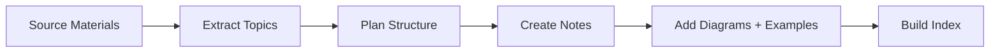
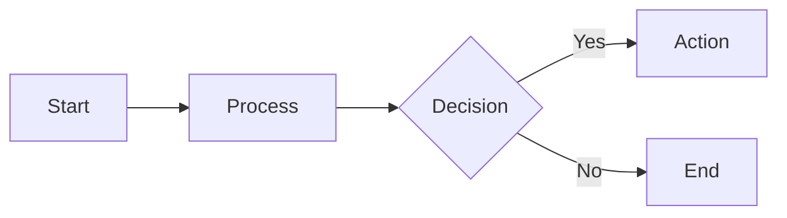
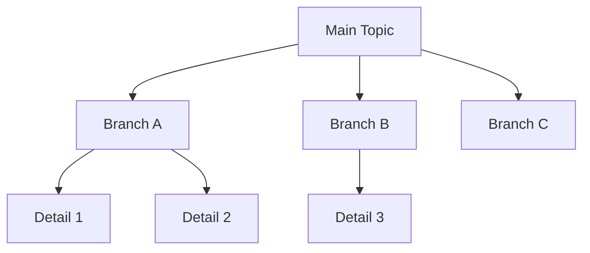
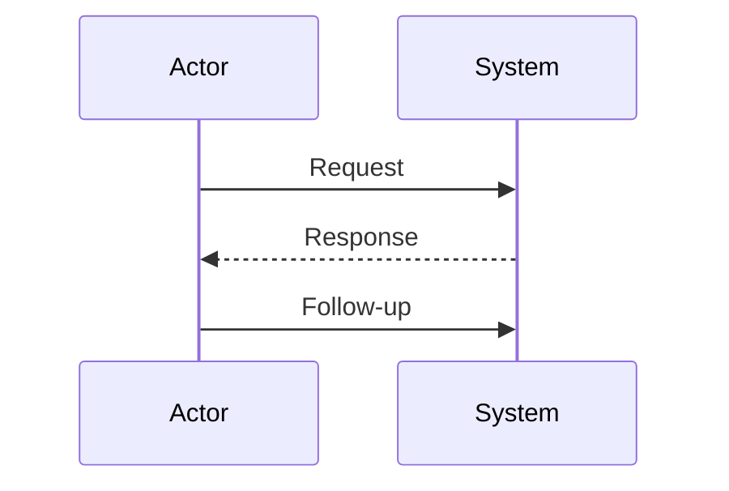
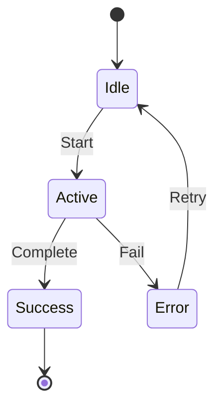
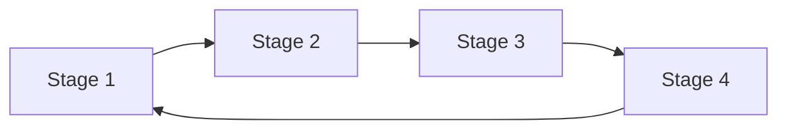
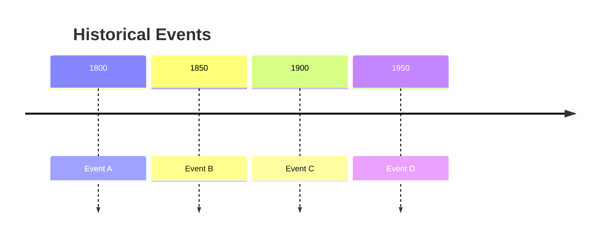
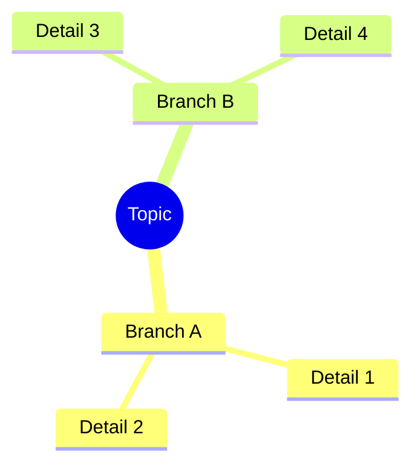

# Study Notes Creator

Transform source materials into organized, visual study notes with themed folders, rich diagrams, and example-based learning.

## Workflow



---

## Step 1: Understand the Source

1. **Read the source** - PDFs, lecture notes, existing docs
2. **Identify 5-8 main topics** - Major themes
3. **Find subtopics** - What falls under each theme?
4. **Note example opportunities** - Where can real examples help?

---

## Step 2: Plan Folder Structure

```
subject/
├── README.md                    # Master index
├── concepts/                    # Core theory
│   ├── 01-introduction.md
│   └── 02-fundamentals.md
├── techniques/                  # How-to procedures
│   ├── 01-method-a.md
│   └── 02-method-b.md
├── examples/                    # Worked problems
│   ├── 01-basic-examples.md
│   └── 02-advanced-examples.md
└── practice/                    # Exercises
    └── 01-exercises.md
```

---

## Step 3: Note Template

```markdown
# [Topic Title]

One sentence summary.

## Overview

[Mermaid diagram showing the main concept]

## Key Concepts

### Concept 1

Brief explanation.

**Example:**
[Concrete example with real-world scenario]

## Summary Table

| Term | Definition | Example |
|------|------------|---------|
| A | What A is | Real use case |

## Practice Problems

1. Problem statement
   <details>
   <summary>Solution</summary>
   Step-by-step solution
   </details>

## Related

- [[other-note]] - Connection
```

---

## Step 4: Mermaid Diagrams (Primary)

### Flowchart (Process Flow)



**Use for:** Processes, decision trees, algorithms, workflows

### Flowchart TB (Hierarchy/Tree)



**Use for:** Taxonomies, classifications, org charts, topic breakdowns

### Sequence Diagram



**Use for:** Interactions, conversations, API calls, cause-effect chains

### State Diagram



**Use for:** Lifecycles, status changes, phases, state machines

### Cycle Diagram



**Use for:** Water cycle, feedback loops, iterative processes, life cycles

### Timeline



**Use for:** Historical timelines, project phases, evolution of concepts

### Mind Map



**Use for:** Brainstorming, topic overviews, concept relationships

---

## Step 5: ASCII Diagrams (Edge Cases)

Use ASCII only for:
- **Overview boxes** with custom text layout
- **Layer/stack diagrams**
- **Comparison layouts**

### Overview Box

```
┌─────────────────────────────────────────────────────────────────────────────┐
│                              TOPIC TITLE                                    │
├─────────────────────────────────────────────────────────────────────────────┤
│                                                                             │
│  Key Point 1    Key Point 2    Key Point 3                                  │
│      │              │              │                                        │
│  [details]      [details]      [details]                                    │
│                                                                             │
└─────────────────────────────────────────────────────────────────────────────┘
```

### Layers/Stack

```
┌─────────────────────────────────────────────────────────────────────────────┐
│                              Layer 4 (Top)                                  │
├─────────────────────────────────────────────────────────────────────────────┤
│                              Layer 3                                        │
├─────────────────────────────────────────────────────────────────────────────┤
│                              Layer 2                                        │
├─────────────────────────────────────────────────────────────────────────────┤
│                              Layer 1 (Bottom)                               │
└─────────────────────────────────────────────────────────────────────────────┘
```

### Box Characters Reference

```
Corners: ┌ ┐ └ ┘   Lines: ─ │   T-joints: ├ ┤ ┬ ┴   Arrows: ▶ ▼ ◀ ▲
```

---

## Step 6: Example-Based Learning Patterns

### Pattern 1: Concept → Example → Variation

```markdown
## [Concept Name]

**Definition:** Brief explanation.

**Example:**
[Concrete, real-world scenario]

**Variation:**
What if [different condition]? → [Different outcome]
```

**Cross-discipline examples:**

| Subject | Concept | Example | Variation |
|---------|---------|---------|-----------|
| Biology | Osmosis | Red blood cells in salt water shrink | In pure water? → Cells swell |
| Economics | Supply/Demand | Oil price rises when OPEC cuts production | New oil discovered? → Price falls |
| Physics | Momentum | Bowling ball vs tennis ball at same speed | Same mass, different speed? |
| History | Cause/Effect | Industrial Revolution → urbanization | No steam engine? |

### Pattern 2: Problem → Solution → Explanation

```markdown
**Problem:** [Specific question]

**Solution:**
Step 1: [Action]
Step 2: [Action]
Result: [Answer]

**Why it works:** [Underlying principle]
```

### Pattern 3: Compare and Contrast

| Aspect | Topic A | Topic B |
|--------|---------|---------|
| Feature 1 | ... | ... |
| Feature 2 | ... | ... |

**Similarities:** Both...
**Key Difference:** A is... while B is...

---

## Step 7: Build the Index

```markdown
# [Subject Name]

Brief description.

## Quick Navigation

### 📚 Core Concepts
- [[concepts/01-topic|Topic Name]] - Brief description

### 🔧 Techniques/Methods
- [[techniques/01-method|Method Name]] - Brief description

### 💡 Examples
- [[examples/01-basic|Basic Examples]] - Start here

---

*Last updated: YYYY-MM-DD*
```

---

## Quality Checklist

- [ ] Every note has at least 1 Mermaid diagram
- [ ] Every concept has at least 1 concrete example
- [ ] Examples use real, relatable scenarios
- [ ] Folder structure is numbered for reading order
- [ ] README links to all notes
- [ ] Wikilinks connect related topics
